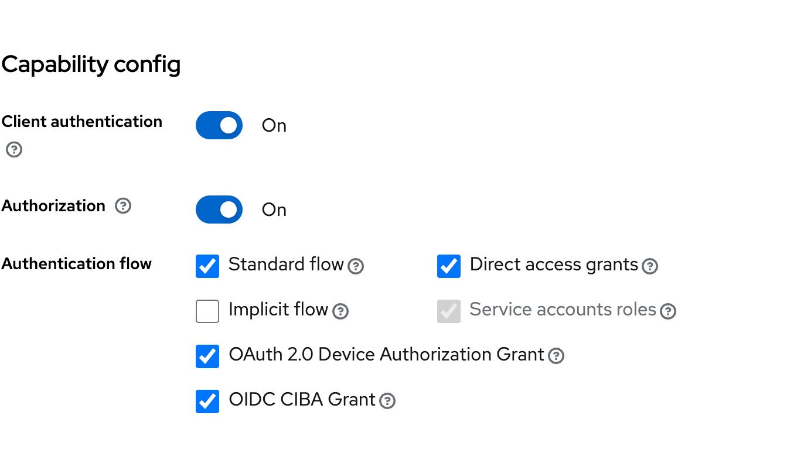

# OAuth 2.0 support for Confluent Platform 

Reference:
- https://docs.confluent.io/platform/current/kafka/authentication_sasl/authentication_sasl_oauth.html
- https://www.keycloak.org/docs/24.0.1/authorization_services/#_resource_server_create_clientb 

# Keycloak

Add following to /etc/hosts:

```
127.0.0.1	keycloak
```

Start:

```shell
docker compose up -d
```

Access Administration Console in http://keycloak:8080/ with user/password admin/admin and create a Real myrealm.

Create a Client named my-resource-center. Click Next. 

Toggle Client authentication to ON. Click Save.

Type the Root URL for your application. For example:

```
http://${host}:${port}/my-resource-server
```

You should have something like this:



Under Keys Toggle **Use JWKS URL**.

Under Credentials copy the Client Secret for Client Authenticator "Client Id and Secret". Update the file [client.properties](./client.properties) with the corresponding copied secret.     

Under Client scopes go to my-resource-center-dedicated and add a Mapper from configuration Audience and set Included Client Audience my-resource-center.

# Restart the boker

```shell
docker compose up -d
```

Execute:

```shell
kafka-topics --bootstrap-server localhost:9095 --topic test --create --partitions 3 --replication-factor 1 --command-config ./client.properties
```

And after:

```shell
kafka-topics --bootstrap-server localhost:9095 --list --command-config ./client.properties
```